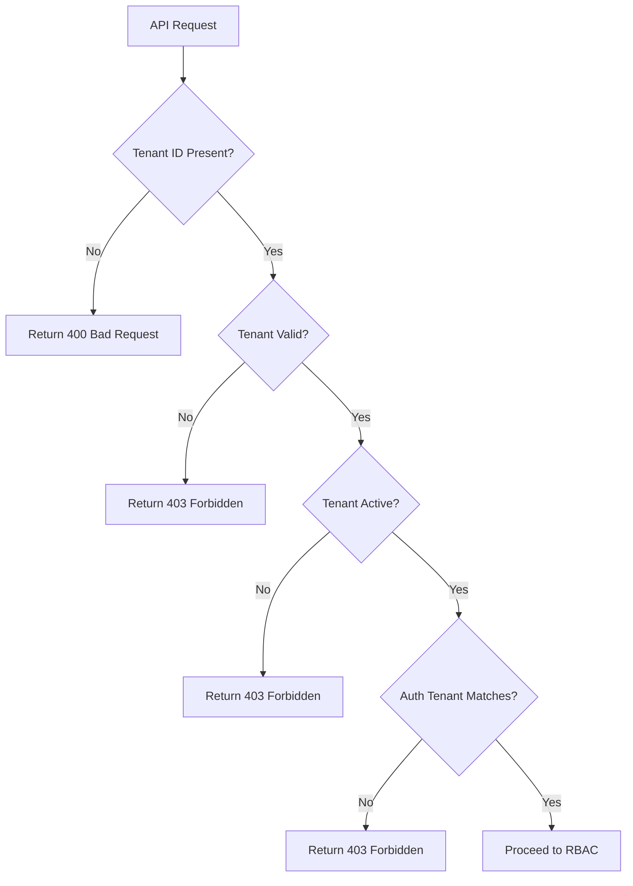

# RBAC & Security Guide
## StudyMate School Orchestrator - Sprint 3

**Version:** 1.0
**Date:** 2025-11-12
**Status:** Production Ready

---

## Table of Contents

1. [Overview](#overview)
2. [Multi-Tenant Isolation](#multi-tenant-isolation)
3. [Role-Based Access Control (RBAC)](#role-based-access-control-rbac)
4. [Implementation Guide](#implementation-guide)
5. [Security Best Practices](#security-best-practices)
6. [Testing & Validation](#testing--validation)
7. [Troubleshooting](#troubleshooting)

---

## Overview

The StudyMate School Orchestrator implements a comprehensive security model with two primary layers:

1. **Tenant Isolation**: Strict data separation between different schools/establishments
2. **RBAC**: Fine-grained permissions based on user roles within each tenant

### Key Security Principles

- **Zero Trust**: Every request is authenticated and authorized
- **Least Privilege**: Users only have access to what they need
- **Defense in Depth**: Multiple security layers (auth, tenant, RBAC, ownership)
- **Audit Trail**: All security events are logged
- **Fail Secure**: Errors default to deny access

---

## Multi-Tenant Isolation

### What is Multi-Tenancy?

Each school (tenant) has complete data isolation. A user from School A cannot access data from School B, even if they have the same role.

### How It Works

Every API request must include a tenant identifier:

**Option 1: HTTP Header (recommended for JWT)**
```http
X-Orchestrator-Id: TENANT_INST_PARIS
```

**Option 2: Request Body (for URLENCODED auth)**
```json
{
  "tenant_id": "TENANT_INST_PARIS",
  ...
}
```

### Tenant Validation Flow



### Database Schema

All tenant-aware tables have a `tenant_id` column:

```sql
CREATE TABLE assignments (
    id VARCHAR(50) PRIMARY KEY,
    tenant_id VARCHAR(50) NOT NULL,  -- ✅ Tenant isolation
    teacher_id VARCHAR(50) NOT NULL,
    -- ...
    FOREIGN KEY (tenant_id) REFERENCES tenants(id) ON DELETE CASCADE,
    INDEX idx_tenant_status (tenant_id, status)
);
```

### Tenant Middleware Usage

```php
// At the beginning of every protected endpoint
$tenantContext = enforceTenantIsolation();

// Get tenant ID for queries
$tenantId = $tenantContext->getTenantId();

// Verify resource ownership
$tenantContext->verifyOwnership($resource['tenant_id'], 'assignment', $resourceId);
```

---

## Role-Based Access Control (RBAC)

### Available Roles

| Role | Scope | Description |
|------|-------|-------------|
| **admin** | Tenant-wide | Full access to all resources within the tenant |
| **direction** | Tenant-wide | Access to aggregated views, reports, user management |
| **teacher** | Own resources | CRUD on own assignments/themes, view own students |
| **inspector** | Read-only | Audit access to all stats and assignments (read-only) |
| **intervenant** | Limited | Access to assigned classes only |

### Permission Matrix

#### Assignments

| Action | Admin | Direction | Teacher | Inspector | Intervenant |
|--------|:-----:|:---------:|:-------:|:---------:|:-----------:|
| Create | ✅ | ✅ | ✅ | ❌ | ❌ |
| Read (own) | ✅ | ✅ | ✅ | ❌ | ❌ |
| Read (all) | ✅ | ✅ | ❌ | ✅ | ❌ |
| Update (own) | ✅ | ✅ | ✅ | ❌ | ❌ |
| Update (any) | ✅ | ✅ | ❌ | ❌ | ❌ |
| Delete (own) | ✅ | ✅ | ✅ | ❌ | ❌ |
| Delete (any) | ✅ | ✅ | ❌ | ❌ | ❌ |
| Push to ErgoMate | ✅ | ✅ | ✅ | ❌ | ❌ |

#### Students

| Action | Admin | Direction | Teacher | Inspector | Intervenant |
|--------|:-----:|:---------:|:-------:|:---------:|:-----------:|
| Read | ✅ | ✅ | ✅ | ✅ | ✅ |
| Read (all) | ✅ | ✅ | ❌ | ✅ | ❌ |
| Create | ✅ | ✅ | ❌ | ❌ | ❌ |
| Update | ✅ | ✅ | ❌ | ❌ | ❌ |
| Delete | ✅ | ✅ | ❌ | ❌ | ❌ |

#### Stats (ErgoMate Data)

| Action | Admin | Direction | Teacher | Inspector | Intervenant |
|--------|:-----:|:---------:|:-------:|:---------:|:-----------:|
| Read (own students) | ✅ | ✅ | ✅ | ❌ | ❌ |
| Read (all) | ✅ | ✅ | ❌ | ✅ | ❌ |
| Trigger Sync | ✅ | ✅ | ✅ | ❌ | ❌ |

#### Dashboard

| Action | Admin | Direction | Teacher | Inspector | Intervenant |
|--------|:-----:|:---------:|:-------:|:---------:|:-----------:|
| View Summary | ✅ | ✅ | ✅ | ✅ | ❌ |
| View Aggregated | ✅ | ✅ | ❌ | ✅ | ❌ |
| Export Reports | ✅ | ✅ | ❌ | ✅ | ❌ |

#### Themes (Content)

| Action | Admin | Direction | Teacher | Inspector | Intervenant |
|--------|:-----:|:---------:|:-------:|:---------:|:-----------:|
| Create | ✅ | ✅ | ✅ | ❌ | ❌ |
| Read | ✅ | ✅ | ✅ | ✅ | ✅ |
| Update (own) | ✅ | ✅ | ✅ | ❌ | ❌ |
| Update (any) | ✅ | ✅ | ❌ | ❌ | ❌ |
| Delete (own) | ✅ | ✅ | ✅ | ❌ | ❌ |
| Delete (any) | ✅ | ✅ | ❌ | ❌ | ❌ |

### RBAC Middleware Usage

```php
// After tenant isolation
$rbac = enforceRBAC($auth);

// Check permission
$rbac->requirePermission('assignments', 'create');

// Check ownership
$rbac->requireOwnership('assignments', $assignment, 'update_any');

// Apply ownership filter to query
$ownershipWhere = $rbac->ownershipWhere('assignments', 'teacher_id', 'a');
$sql = "SELECT * FROM assignments a WHERE $ownershipWhere";
```

---

## Implementation Guide

### Step-by-Step Integration

#### 1. Include Middleware

```php
require_once __DIR__ . '/../.env.php';
require_once __DIR__ . '/_middleware_tenant.php';
require_once __DIR__ . '/_middleware_rbac.php';
```

#### 2. Enforce Security Layers

```php
// 1. Tenant isolation
$tenantContext = enforceTenantIsolation();

// 2. Authentication
$auth = requireAuth();

// 3. Verify tenant match
enforceTenantAuthMatch($tenantContext, $auth);

// 4. RBAC setup
$rbac = enforceRBAC($auth);

// 5. Check permissions
$rbac->requirePermission('assignments', 'read');
```

#### 3. Use Secure Queries

```php
$tenantId = $tenantContext->getTenantId();

// Always filter by tenant
$assignments = db()->query(
    'SELECT * FROM assignments WHERE tenant_id = ? AND teacher_id = ?',
    [$tenantId, $rbac->getUserId()]
);

// Verify ownership of referenced resources
$theme = db()->queryOne('SELECT * FROM themes WHERE id = ?', [$themeId]);
$tenantContext->verifyOwnership($theme['tenant_id'], 'theme', $theme['id']);
```

#### 4. Add Audit Logging

```php
// Log sensitive operations
logSensitiveAccess('assignments', $assignmentId, 'update', [
    'user_id' => $rbac->getUserId(),
    'role' => $rbac->getRole()
]);

// Log tenant violations (automatic in middleware)
// Log RBAC denials (automatic in middleware)
```

### Complete Example: Update Assignment

```php
if ($method === 'PATCH' && $assignmentId) {
    // Security middleware
    $tenantContext = enforceTenantIsolation();
    $auth = requireAuth();
    enforceTenantAuthMatch($tenantContext, $auth);
    $rbac = enforceRBAC($auth);

    $tenantId = $tenantContext->getTenantId();

    // Load assignment with tenant filter
    $assignment = db()->queryOne(
        'SELECT * FROM assignments WHERE id = ? AND tenant_id = ?',
        [$assignmentId, $tenantId]
    );

    if (!$assignment) {
        errorResponse('NOT_FOUND', 'Assignment not found', 404);
    }

    // Check ownership or admin permission
    $rbac->requireOwnership('assignments', $assignment, 'update_any');

    // Perform update
    $body = getRequestBody();
    db()->update('assignments', [
        'title' => $body['title'],
        'updated_at' => date('Y-m-d H:i:s')
    ], ['id' => $assignmentId]);

    // Audit log
    logSensitiveAccess('assignments', $assignmentId, 'update', [
        'user_id' => $rbac->getUserId(),
        'role' => $rbac->getRole(),
        'tenant_id' => $tenantId
    ]);

    jsonResponse(['success' => true]);
}
```

---

## Security Best Practices

### DO ✅

1. **Always validate tenant ID** in every protected endpoint
2. **Filter all queries by tenant_id** - no exceptions
3. **Check ownership** for resources that have owners
4. **Log sensitive operations** for audit trail
5. **Use prepared statements** to prevent SQL injection
6. **Verify referenced resources** belong to same tenant
7. **Return generic error messages** (don't leak information)
8. **Test with different roles** before deploying

### DON'T ❌

1. **Never trust client-provided tenant_id** without validation
2. **Don't skip RBAC checks** for "simple" endpoints
3. **Don't expose internal IDs** in error messages
4. **Don't query without tenant filter** (even for admin)
5. **Don't assume ownership** - always verify
6. **Don't log sensitive data** (passwords, API keys)
7. **Don't hardcode permissions** - use RBAC middleware
8. **Don't allow SQL injection** - use parameterized queries

### Common Vulnerabilities to Avoid

#### ❌ Cross-Tenant Data Leak

```php
// BAD - no tenant filter
$assignment = db()->queryOne('SELECT * FROM assignments WHERE id = ?', [$id]);
```

```php
// GOOD - tenant filtered
$assignment = db()->queryOne(
    'SELECT * FROM assignments WHERE id = ? AND tenant_id = ?',
    [$id, $tenantId]
);
```

#### ❌ Permission Bypass

```php
// BAD - no RBAC check
$assignment = updateAssignment($id, $data);
```

```php
// GOOD - RBAC enforced
$rbac->requirePermission('assignments', 'update');
$rbac->requireOwnership('assignments', $assignment, 'update_any');
$assignment = updateAssignment($id, $data);
```

#### ❌ Resource Reference Attack

```php
// BAD - no tenant verification on theme
$assignment = createAssignment($tenantId, $themeId, $data);
```

```php
// GOOD - verify theme belongs to same tenant
$theme = db()->queryOne('SELECT * FROM themes WHERE id = ?', [$themeId]);
$tenantContext->verifyOwnership($theme['tenant_id'], 'theme', $themeId);
$assignment = createAssignment($tenantId, $themeId, $data);
```

---

## Testing & Validation

### Manual Testing Checklist

- [ ] Test with valid same-tenant access (should succeed)
- [ ] Test with missing X-Orchestrator-Id header (should return 400)
- [ ] Test with invalid tenant ID (should return 403)
- [ ] Test with inactive/suspended tenant (should return 403)
- [ ] Test cross-tenant access attempt (should return 403)
- [ ] Test tenant-auth mismatch (should return 403)
- [ ] Test with each role (admin, direction, teacher, inspector)
- [ ] Test ownership violations (should return 403)
- [ ] Test RBAC permission violations (should return 403)
- [ ] Verify audit logs contain security events

### Automated Test Suite

Run the integration tests:

```bash
# Tenant isolation tests
php orchestrator/tests/integration/TenantIsolationTest.php

# RBAC permission tests
php orchestrator/tests/integration/RBACTest.php
```

### Security Audit

Check the audit logs for suspicious activity:

```bash
grep "SECURITY" orchestrator/logs/app.log
grep "Tenant Violation" orchestrator/logs/app.log
grep "RBAC Denial" orchestrator/logs/app.log
```

---

## Troubleshooting

### Common Issues

#### "Missing tenant identifier" (400)

**Cause:** Request missing X-Orchestrator-Id header or tenant_id parameter

**Solution:**
- For JWT auth: Add `X-Orchestrator-Id` header
- For URLENCODED auth: Include `tenant_id` in request body

#### "Tenant mismatch" (403)

**Cause:** Authenticated user's tenant doesn't match request tenant

**Solution:**
- Verify JWT token contains correct tenant_id
- Ensure X-Orchestrator-Id matches user's tenant
- Don't attempt cross-tenant access

#### "Insufficient permissions" (403)

**Cause:** User role doesn't have required permission

**Solution:**
- Check permission matrix for your role
- Request access from admin if needed
- Use correct account for the operation

#### "You can only access your own [resource]" (403)

**Cause:** Teacher trying to access another teacher's resource

**Solution:**
- Teachers can only access own assignments/themes
- Use admin or direction account for cross-user access
- Check resource owner matches authenticated user

### Debug Mode

Enable debug logging to see detailed security checks:

```php
// In .env.php
define('LOG_LEVEL', 'DEBUG');
```

Then check logs:

```bash
tail -f orchestrator/logs/app.log | grep -E "SECURITY|RBAC|Tenant"
```

---

## API Error Responses

### 400 Bad Request - Missing Tenant

```json
{
  "error": "missing_tenant_id",
  "message": "Tenant identifier is required. Please provide X-Orchestrator-Id header or tenant_id parameter."
}
```

### 403 Forbidden - Invalid Tenant

```json
{
  "error": "invalid_tenant",
  "message": "Tenant not found or invalid."
}
```

### 403 Forbidden - Tenant Mismatch

```json
{
  "error": "tenant_mismatch",
  "message": "Your authentication tenant does not match the requested tenant."
}
```

### 403 Forbidden - Insufficient Permissions

```json
{
  "error": "forbidden",
  "message": "You do not have permission to update assignments.",
  "required_permission": "assignments:update",
  "your_role": "inspector"
}
```

### 403 Forbidden - Ownership Violation

```json
{
  "error": "forbidden",
  "message": "You can only access your own assignments.",
  "your_role": "teacher"
}
```

---

## Compliance & Audit

### Data Protection

- **GDPR Compliance**: Each tenant is a separate data controller
- **Data Isolation**: No cross-tenant data sharing
- **Right to be Forgotten**: Cascade delete on tenant removal
- **Access Logging**: All access attempts are logged

### Audit Trail

All security events are logged in `orchestrator/logs/app.log`:

```json
{
  "timestamp": "2025-11-12T10:30:00Z",
  "level": "WARN",
  "message": "SECURITY: Tenant Violation",
  "violation_type": "cross_tenant_access",
  "severity": "high",
  "tenant_id": "TENANT_INST_PARIS",
  "user_id": "USER_123",
  "ip": "192.168.1.100",
  "uri": "/api/assignments"
}
```

### Monitoring

Set up alerts for security events:

- Multiple failed tenant validations from same IP
- Repeated RBAC denials for same user
- Cross-tenant access attempts
- Access to suspended/archived tenants

---

## Support & Resources

- **Integration Guide**: `/orchestrator/docs/MIDDLEWARE_INTEGRATION_GUIDE.md`
- **OpenAPI Spec**: `/orchestrator/docs/openapi-orchestrator.yaml`
- **Test Suite**: `/orchestrator/tests/integration/`
- **Source Code**:
  - Tenant Middleware: `/orchestrator/api/_middleware_tenant.php`
  - RBAC Middleware: `/orchestrator/api/_middleware_rbac.php`

---

**Document Version:** 1.0
**Last Updated:** 2025-11-12
**Maintained by:** StudyMate Development Team
